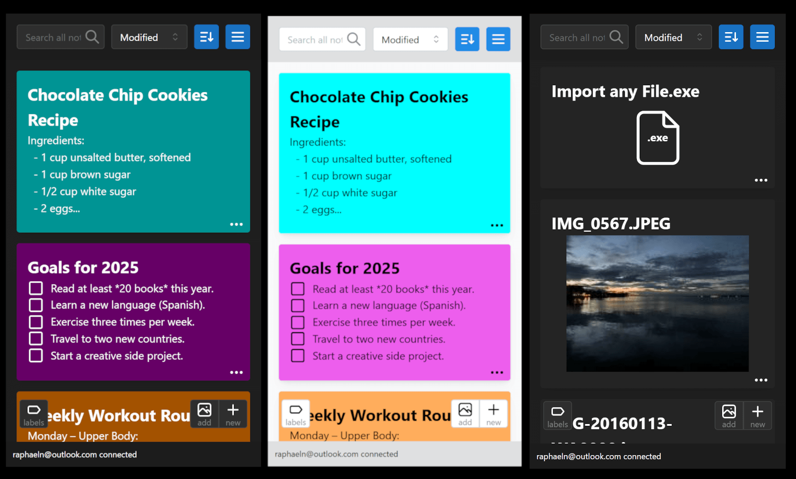

# ciphernotes

A end-to-end encrypted note taking alternative to Google Keep. Offline and cloud synchronized.

## Screenshots

## Features

- Works completely offline (local-first).
- Text and files are encrypted before they're synced.
- No ads, no trackers, no unnecessary cookies.
- No account required for local use.
- Synchs immediately across all platforms.
- Dark- and Light-Mode.
- Todo lists with sub-tasks.
- Import and view images and videos.
- Import files of any type.
- Organize with labels.
- Google Keep import.
- Export and import notes including files.
- Fully keyboard navigatable.
- Keyboard shortcuts, open notes with cmd+k or ctrl+k.
- Text-editor with multi-cursor support and other shortcuts.
- Archive unused notes.
- Share encryption key via QR-Code directly from app to app.

## Bug Reports and Feature Requests

Please report bugs and request features on the [GitHub Issues](https://github.com/rapnuss/ciphernotes/issues) page.

## Links

- [Web-App](https://ciphernotes.com)
- [Play Store](https://play.google.com/store/apps/details?id=com.ciphernotes.twa)
- [Privacy Policy](https://ciphernotes.com/privacy)
- [Terms & Conditions](https://ciphernotes.com/terms)
- [Self Hosting Image](https://hub.docker.com/r/rapnuss/ciphernotes)
